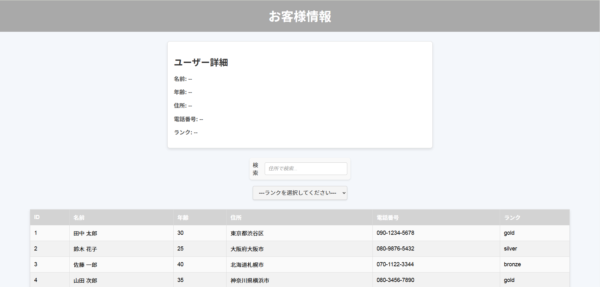

# JS講習会: 配列・オブジェクトをマスターしよう！


## 概要

お客様管理アプリを作り、配列とオブジェクトについて実践形式で身に着けよう！

## デモ




## 主な機能

- 一覧表示
- 詳細表示
- 検索

## 補足知識

補足の知識について以下に記述します。

```bash
# リポジトリをクローン
git clone https://github.com/ユーザー名/リポジトリ名.git

# ディレクトリに移動
cd リポジトリ名

# 必要な依存関係をインストール
npm install
